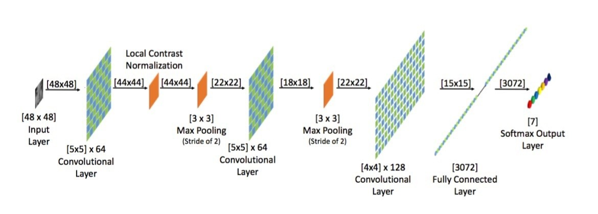
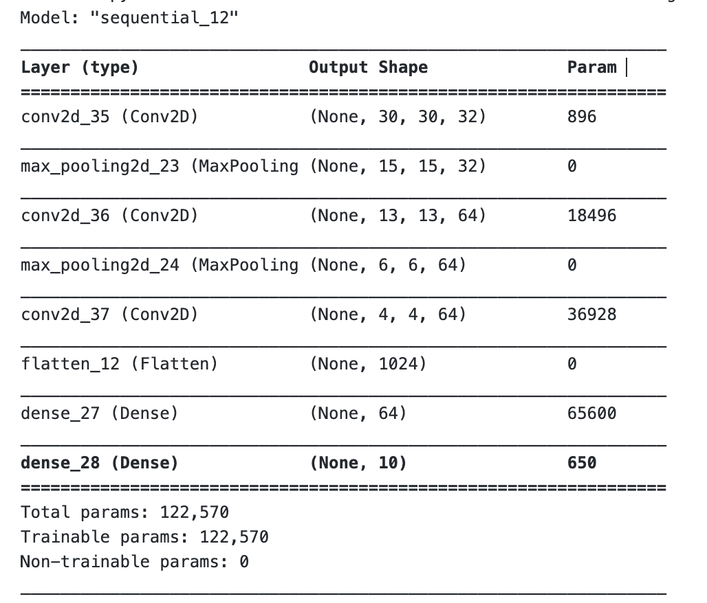

# Deep-Learning
This repository is used to demonstrate deep learning algorithm (Convolutional Neural Network) using TensorFlow. 
# Part A - Deep Learning model - Convolutional Neural Network (CNN)
## Abstract
The goal of this project is to create a Deep Learning model using Convolutional Neural Networks. The dataset consists of images of 5 types of ships which are labeled {'Cargo': 1, 'Military': 2, 'Carrier': 3, 'Cruise': 4, 'Tankers': 5}. The Convolutional Neural Network (CNN) is trained with the images of all these types of ships using a 60% of the data and validated simulataneously against 20% of the data and finally test the trained model with the remaining 20% of the data. The model is adjusted with various hyperparameters like using different activation functions, loss functions, changing the epochs, using different neural network initializing methods, changing network size and number of layers and finally obtaining the best accurate version of the CNN for the data. The programming is done in TensorFlow API by Google and the 'loss and accuracy' plot indicates how good or bad the network is trained aganist the data.

### Dependencies
    
   1. TensorFlow - Refer this <a href="https://www.tensorflow.org/install/pip#system-install">link</a> for installation instructions.
   2. Scikit-learn - Installation instructions <a href="https://scikit-learn.org/stable/install.html">here</a>
   3. NumPy - Installation instructions <a href="https://numpy.org/install/">here</a>
   4. Pandas - Installation instructions <a href="https://pandas.pydata.org/getting_started.html">here</a>
   5. Matplotlib - Installation instructions <a href="https://matplotlib.org/stable/users/installing.html">here</a>
    
### PART B - Changing Activations
Activations are changed, keeping all other hyperparameters constant for differentiation

### PART C - Changing Cost Function
Cost Functions are changed, keeping all other hyperparameters constant

### PART D - Changing Epochs
Epochs are changed, keeping all other hyperparameters constant

### PART E - Changing Gradients
Gradients are changed, keeping all other hyperparameters constant

### PART F - Changing Intialization
Initializations are changed, keeping all other hyperparameters constant

### PART G - Changing Hyperparameters
The network architectures, no of layers, epochs and filter sizes were all changed during the course of the earlier training to understand the results and decide which is values of hyperoaramets are functioning better?

## The CNN model:
Parameters:

- Activation function = ReLU

- Loss function = SparseCategoricalCrossentropy()

- Optimizer = ADAM

## MODEL SUMMARY - MODEL 1
In the Jupyter Notebook furthers models can be found. Illustrating one model results below.

## The model is trained for 15 epochs and the maximum validation accuracy achieved is 65.83%

## Results
1. The model is trained with epochs of 15 initially but repeated training of the model in the running kernel makes the model overfit the data and could result in fake accuracies.
2. With hyperparameter tuning, the model is improved by initialising with Xavier Glorot Initialization namely Xavier Uniform and Xavier Gaussian.
3. It has been observed that the model performed with other loss functions and optimisers but could yield better results with appropriate batch size
4. Meanwhile, it is also concluded that using different layers and adding more layers in the model would only increase the comkplexity but not improve the accuray unless an appropriate activation function is given.
5. Later, the model is tuned with various epochs and batch_size to improve accuracy.
6. Finally, the CNN gave the maximum accuracy of 63% with initial relu activation function and adam optimiser and no initialization and SparseCategoricalCrossEntropy as the best loss function.

# CITATIONS
References:

[1] ADL (24 April 2018), "An intuitive guide to Convolutional Neural Networks" retrieved from https://www.freecodecamp.org/news/an-intuitive-guide-to-convolutional-neural-networks-260c2de0a050/
[2] TensorFlow Tutorials,"Convolutional Neural Network (CNN)" retrieved from https://www.tensorflow.org/tutorials/images/cnn
[3] Analytics Vidhya Courses, "Convolutional Neural Networks (CNN) from Scratch" retrieved from https://courses.analyticsvidhya.com/courses/take/convolutional-neural-networks-cnn-from-scratch/texts/10844923-what-is-a-neural-network
[4] TensorFlow Core Documentation, "Module: tf.keras.initializers" retrieved from https://www.tensorflow.org/api_docs/python/tf/keras/initializers?version=nightly

# CONTRIBUTIONS
90% contributed by me, 10% derived from official documentation
